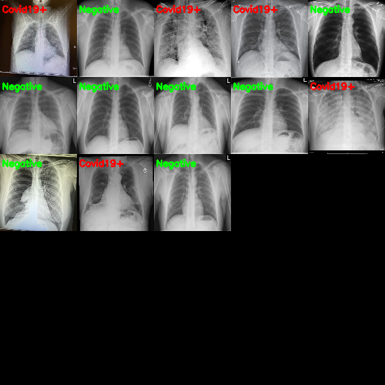
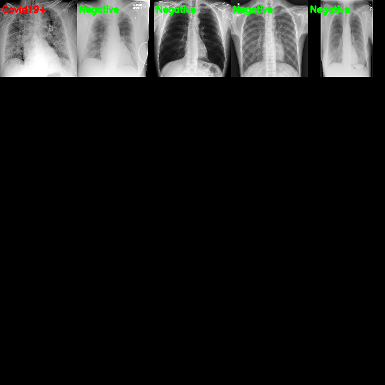

This program is inspired by Adrian Rosebrock tutorials and aims to become a reliable source of automated detection of CT and RX scans to find infections caused by COVID19. 

We can train a model and then test the model in load_own_model.py @ load_model.py file to test if an image is positive or negative.

## Getting Started

Build a dataset with build_covid_dataset.py
Train your model with train_covid19.py
Test your model against candidates with load_model.py

### Prerequisites

- Python3

- OpenCV

- Tensorflow

- Keras
## Authors

* **Adrian Rosebrock** - *Initial work* - [PyImageSearch](https://github.com/jrosebr1)

* **Joseph Paul Cohen** - *Initial DataSet Curator* - [ieee8023](https://github.com/ieee8023)

## Results

Use the test images after split the data

Use our own images

